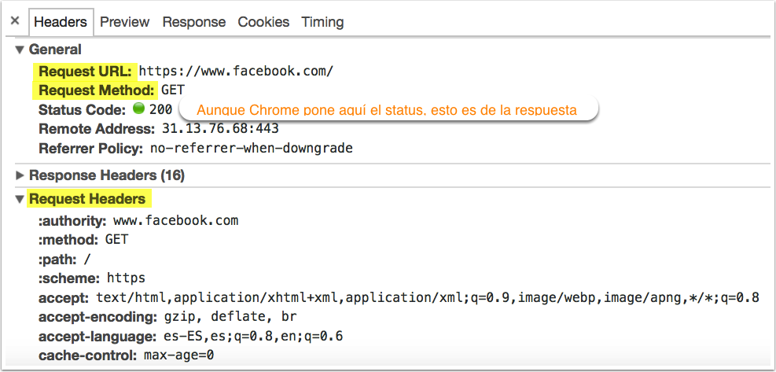
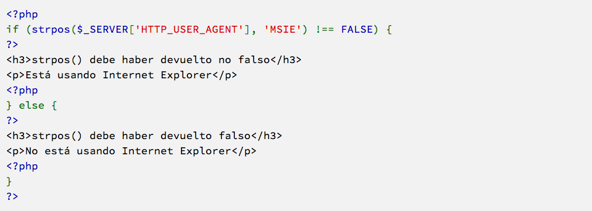
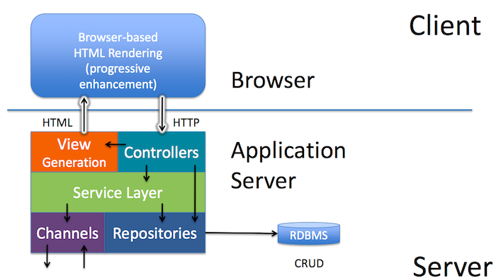
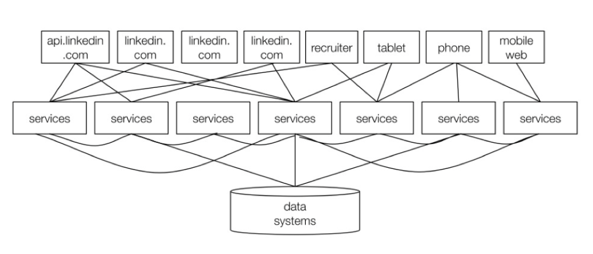
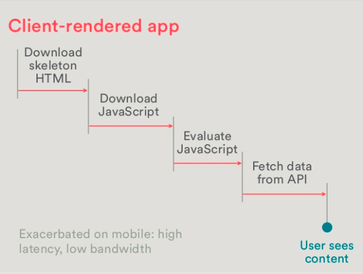
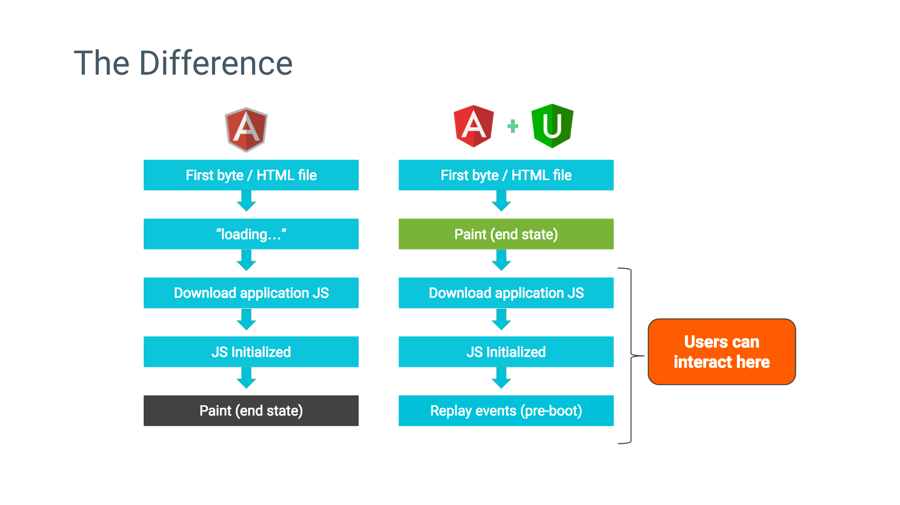

<!-- .slide: class="titulo" -->

# Tema 1
## Introducción a los servicios web REST
# Parte 1
## HTTP y aplicaciones web

---

## Indice

1.  HTTP para sitios web estáticos
2.  HTTP para aplicaciones web
3.  Aplicaciones web "modernas"


---

<!-- .slide: class="titulo" -->

# 1. HTTP para sitios web estáticos


---

## Petición/respuesta HTTP

Un servidor web está a la escucha por un **puerto**, aceptando **peticiones** de recursos (p.ej. archivos HTML) y devolviéndolos como **respuestas**

<!-- .element class="stretch" -->


---

## Observar el tráfico HTTP

* En HTTP1 el intercambio de información es en **modo texto**. En HTTP2 es **binario**
* Herramientas de desarrollador del navegador 


Firefox developer tools: Menú "Tools > Web Developer > Network"
<!-- .element class="caption" -->

---

## Petición HTTP

Típicamente una petición contiene el **método** (o *tipo*), la **URL** solicitada y **cabeceras** con información adicional. En HTTP2 el método y la URL se tratan también como cabeceras

 

---

## Métodos de petición

*   **GET** solicitar un recurso 
*   **POST** enviar datos al servidor
*   **PUT** actualizar recurso, **DELETE**: eliminar recurso
    * No permitidos en la mayoría de recursos por motivos evidentes
    * Los navegadores no los usan en la navegación "normal", se necesita Javascript para lanzar estos métodos

---

## Respuesta HTTP


Una respuesta contiene un **código de estado**, unas **cabeceras** con información adicional y normalmente los **datos** solicitados por el cliente

```http
HTTP/1.1 200 OK
Date: Wed, 06 Sep 2017 10:38:21 GMT
Server: Apache
Vary: Accept-Encoding
Content-Encoding: gzip
Content-Length: 27003
Keep-Alive: timeout=5, max=100
Connection: Keep-Alive
Content-Type: text/html

<!DOCTYPE html>
<html lang="es">
<head>
  <title> Universidad de Alicante</title>
    <meta charset="utf-8">
    ...
```

<div class="caption">Respuesta del servidor web de la UA a una petición GET a https://www.ua.es</div>


---

## Códigos de estado

Diferentes rangos numéricos indican distintos tipos de resultados
*   1xx _informational_
*   2xx _success_ (p.ej. `200 OK`)
*   3xx _redirection_ (p. ej. `301 MOVED PERMANENTLY`)
*   4xx _client error_ (p. ej. `404 NOT FOUND`, `400 BAD REQUEST`, `403 FORBIDDEN`, [418 I’M A TEAPOT](http://tools.ietf.org/html/rfc2324) :) )
*   5xx server error

Consultar más en [http://httpstatus.es](http://httpstatus.es)

En la actualidad la mayoría son ignorados por el navegador, que se limita a mostrar el cuerpo de la respuesta.

---

<!-- .slide: class="titulo" -->

# 1.2 HTTP básico para aplicaciones web

---

## Aplicaciones web y HTTP

* <!-- .element: class="fragment" data-fragment-index="1"-->  Una aplicación web es una **colección de "programitas"** o "rutinas". A cada uno se accede a través de una URL
* <!-- .element: class="fragment" data-fragment-index="2" --> La comunicación con las rutinas se hace a través de **HTTP** 
    *   Una petición GET ya no significa "devuelve un recurso", sino **"ejecuta un programa y devuelve el resultado"**
    *   El código de estado se puede interpretar como el **resultado de la ejecución**. p. ej, un 500 se debe a que el programa ha abortado
* <!-- .element: class="fragment" data-fragment-index="3" --> Al igual que en línea de comandos podemos pasar **parámetros** 

<span class="fragment" data-fragment-index="1">http://www.miapp.com/verNota</span><span class="fragment" data-fragment-index="3">?dni=222333444</span>

---

## Aplicación web para consultar notas


---

## GET vs. POST

*   En aplicaciones web "clásicas" **tienen la misma semántica, ejecutar un programa remoto pasándole datos** en forma `parametro=valor&parametro2=valor2...`
*   Algunas diferencias "prácticas"
    *   Los parámetros en POST tienen longitud ilimitada
    *   Los parámetros en GET se ven en la barra de direcciones del navegador

---

## ¿De dónde salen los parámetros?

* De los formularios

```html
<form action="login.php" method="post">
  Usuario: <input type="text" name="login">
  Contraseña: <input type="password" name="password">
  <input type="submit" value="Entrar">
</form>
```

* "Embebidos" en los enlaces

```html
<a href="verUsuario?dni=11222333">Luis Ricardo Borriquero</a>
```

* Desde la aparición de Javascript y AJAX, se pueden crear/manipular como queramos

---

## Plantillas HTML en el servidor

*   Facilitan la tarea de generar HTML dinámicamente, ya que generar todo el HTML a base de "cout" sería engorroso
*   Mezclan bloques de **HTML** "estático" con **sentencias** de algún lenguaje de programación

---

## Ejemplo: PHP



---

## HTTP es un protocolo sin estado

No se guardan datos permanentes entre una petición/respuesta y la siguiente

<div class="caption">[http://xkcd.com/869/](http://xkcd.com/869/)</div>


---

## ¡Pero las *apps* web necesitan estado!

*   Necesitamos que se recuerde si nos hemos autentificado, qué contiene nuestro carrito de la compra, etc...
*   En aplicaciones web "clásicas"
    - Los *frameworks* de desarrollo web facilitan guardar estado en el servidor
    - En el cliente se puede guardar estado en las *cookies* (aunque pocos datos)

---

## Javascript

<div class="stretch"></div>
*   El código se descarga junto con el HTML y se interpreta en el navegador **después de** la petición/respuesta HTTP
   -  Recordemos que el código en el servidor se ejecuta **antes de** enviar la respuesta  
*   Inicialmente se usaba para pequeños cálculos, validación de formularios, [efectos tontos](http://www.javascript-fx.com/mouse_trail/pinwheel/demo.html)

---

## Frontend vs. Backend

Con Javascript aparece el mundo del _desarrollo frontend_

<!-- .element: class="caption" --> ["Picking a Technology Stack"](https://docs.google.com/presentation/d/1pA6reUNKqkfupSogZB4Q42Tk98VAq_loqkIDE-HSxAE/present#slide=id.p), Pamela Fox


---

## Arquitectura "clásica" para apps web

<!-- .element: class="caption" --> Charla: [The New Application Architectures](http://www.infoq.com/presentations/SpringOne-2GX-2012-Keynote-2), Adrian Colyer


---

<!-- .slide: class="titulo" -->

## 3. Aplicaciones web "modernas"

---

## AJAX

Varias tecnologías (un API JS + formato JSON/XML) que permiten **hacer peticiones al servidor sin cambiar de URL, y refrescar solo parte de la página**

Omnipresente en la actualidad. Salvo las webs estáticas prácticamente **todo es AJAX**

---

<!-- .element: class="caption" --> [Geek & Poke, sin AJAX vs. con AJAX](http://geekandpoke.typepad.com/geekandpoke/2012/01/simply-explained.html)

<div class="stretch"></div>

---

## Arquitectura de app web "moderna"

Gracias a AJAX y a Javascript nos podemos llevar **casi todo el código de la aplicación al navegador**, convirtiendo el servidor simplemente en un **API remoto** para guardar/recuperar datos
<div class="caption">Charla: [The New Application Architectures](http://www.infoq.com/presentations/SpringOne-2GX-2012-Keynote-2), Adrian Colyer 

<div class="stretch"> </div>

---

## El estado se traslada al cliente

Datos como el carro de la compra, el listado que estamos viendo en pantalla y podemos modificar, el usuario actual, etc, se guardan en el **cliente**

Técnicamente posible gracias a una serie de APIs Javascript del navegador
  - Local Storage: almacenar pares clave/valor
  - IndexedDB: almacenar bases de datos en el cliente

---

## Single Page Applications

* AJAX "llevado al extremo"
* La aplicación es **un único .HTML** y los cambios en la interfaz se hacen cambiando dinámicamente fragmentos de HTML gracias al JS, no navegando a otras páginas

---

## Ejemplo de SPA en apps móviles

Con un *framework* llamado [Onsen UI](https://onsen.io). Usa etiquetas propias, que una librería JS traduce a HTML aunque la mayoría de SPA usan HTML estándar.

[https://onsen.io/v2/guide/index.html#getting-started](https://onsen.io/v2/guide/index.html#getting-started)


---

## Ventajas de las SPA (I)

Una SPA proporciona una **experiencia de usuario** mucho más cercana a una app nativa que la web "tradicional"

Ejemplo: la versión "estándar" de GMail vs. la [vista "básica" HTML](https://support.google.com/mail/answer/15049?hl=es)

---

## Ventajas de las SPA (II)

Al extraer la interfaz y gran parte de la lógica al *frontend* **el *backend* es el mismo** para todos los clientes (web, app móvil, escritorio, integración con otros sistemas...)




---

## Problemas de las SPA (I)

La **carga inicial** del sitio es mucho más lenta. Gran problema en móviles



---

En 2010 Twitter [cambió su arquitectura *frontend*](https://blog.twitter.com/engineering/en_us/a/2010/the-tech-behind-the-new-twittercom.html), desplazando la creación de interfaz y parte de lógica al cliente, con Javascript. PERO...

>[...] we discovered that the raw parsing and execution of JavaScript caused massive outliers in perceived rendering speed. **In our fully client-side architecture, you don’t see anything until our JavaScript is downloaded and executed**. The problem is further exacerbated if you do not have a high-specification machine or if you’re running an older browser. The bottom line is that **a client-side architecture leads to slower performance** [...]

<div class="caption">["Improving performance on Twitter.com"](https://blog.twitter.com/2012/improving-performance-on-twittercom), del [Blog de *engineering* de Twitter](https://blog.twitter.com/engineering/en_us.html)</div>


---

## Solución: *rendering* "híbrido"

En el **primer acceso** el servidor envía **HTML** "estático", como en una app "clásica". Una vez cargado el contenido, empieza a actuar la SPA

Los *frameworks* de desarrollo en el cliente empiezan a incorporar mecanismos que facilitan implementar esto, p.ej. [Angular Universal](https://universal.angular.io)


<div class="stretch"></div>


---

## Problemas de las SPA (II)

Con **buscadores**: aunque Google indexa y renderiza los sitios dinámicos [desde 2015](https://webmasters.googleblog.com/2015/10/deprecating-our-ajax-crawling-scheme.html) como lo haría un navegador, ejecutando el JS, puede haber problemas. Por ejemplo no sabe cuándo se ha cargado todo el contenido.


---


