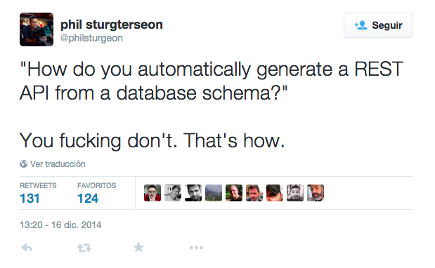
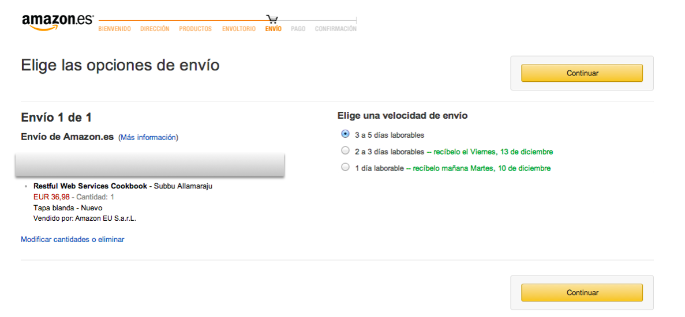
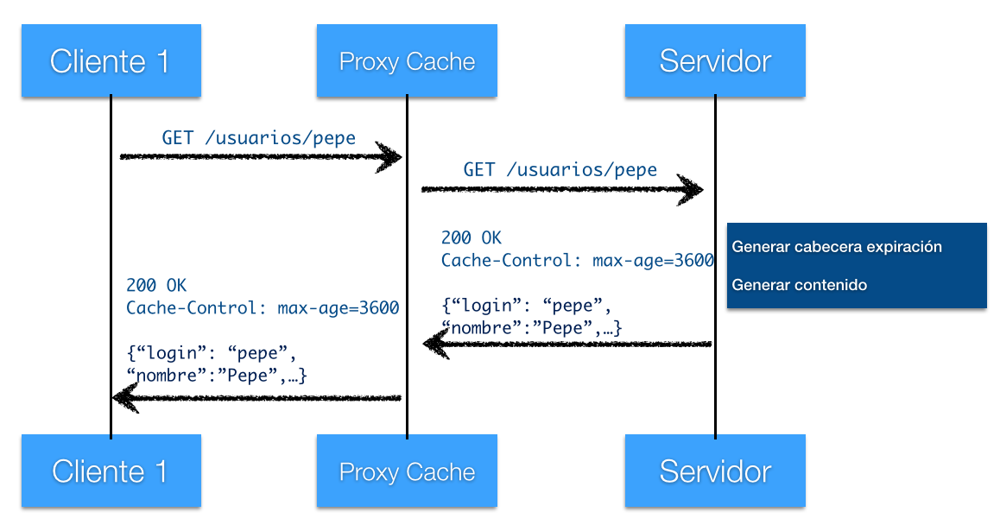
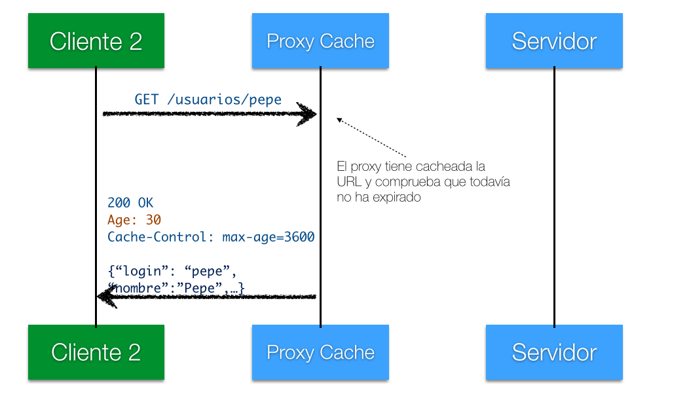
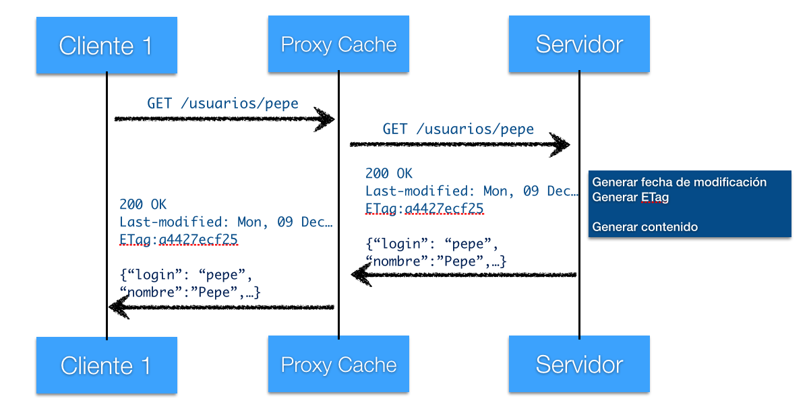
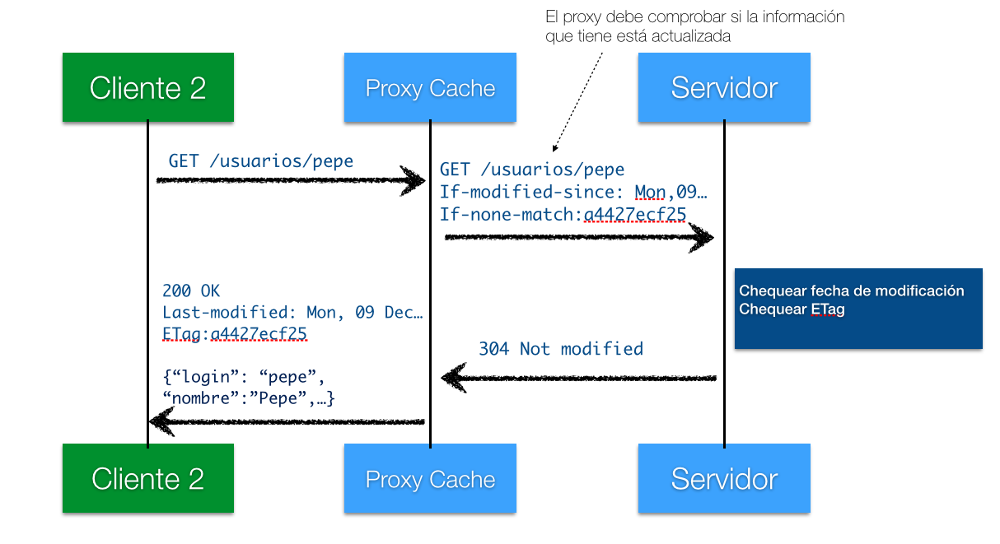

<!-- .slide: class="titulo" -->

# Tema 1
## Introducción a los servicios web REST
# Parte 3
## Diseño de APIs REST

---

## Contenidos

1. REST en detalle
2. Buenas prácticas en el diseño de APIs REST
3. Recursos relacionados entre sí
4. Consultas sobre recursos
5. Buenas prácticas a nivel técnico
6. [Hipermedia](#/sect_hipermedia)
7. [Caches](#/sect_cache)

---

<!-- .slide: class="titulo" -->

# 1. REST en detalle

---

## REST Formalmente

Tiene su origen en [la tesis](www.ics.uci.edu/~fielding/pubs/dissertation/top.htm) de [Roy Fielding](https://twitter.com/fielding),e implica 6 condiciones:

*   Cliente-servidor
*   Interfaz uniforme
    *   Identificación de los recursos
    *   Representaciones estándar
    *   Mensajes auto-descriptivos
    *   Hypermedia as The Engine of The Application State (HATEOAS)
*   Sin estado
*   Cacheable
*   Capas (proxys de modo transparente)
*   Código "bajo demanda" (opcional)


<!-- .element: class="right_vertical_center" -->

---

## Resumen de REST bajo HTTP

Las **llamadas al API** se implementan como **peticiones HTTP**, en las que:

*   La **URL** representa el *recurso*
*   El **método HTTP** representa la *operación*
*   El **código de estado HTTP** representa el *resultado*
*   Como **formato de intercambio de datos** usaremos algún estándar ampliamente difundido (normalmente JSON por legibilidad y facilidad de manejo desde Javascript)

---

## Leer recurso

- Habitualmente **todos los recursos de un tipo** se representan con una URL con el nombre del tipo en plural

```http
https://api.github.com/users/
http://graph.facebook.com/me/photos
```

- La URL de **un recurso concreto** debe ser única. Normalmente se obtiene concatenando a la de todos los recursos el `id` del recurso referenciado.

```http
https://api.github.com/users/octocat
http://graph.facebook.com/me/photos/11000003455
```

---

## Resultado de leer recurso

- **Algunos estados** posibles: **200** (se devuelve el recurso), **404** (el recurso con dicho `id` no existe),  **401** (credenciales incorrectas), **500** (Error del servidor, p.ej. se ha caído la BD)
- La cabecera `Content-Type` especifica el tipo MIME del formato de datos que se está usando

```http
200 OK
Content-Type:application/json

{
  "login": "octocat",
  "id": 583231,
  "avatar_url": "https://avatars.githubusercontent.com/u/583231?v=3",
  ...
}
```

---

## Crear recursos

En general, la URL estará "abierta", apuntando a la colección de recursos, ya que el nuevo recurso todavía no tiene un `id` (típicamente lo asigna automáticamente el servidor)

```http
http://api.ua.es/asignaturas/ADI_34039/anuncios
```

- El método debe ser **POST** 

- Se envía el nuevo recurso en el cuerpo de la petición

```http
POST http://api.ua.es/asignaturas/ADI_34039/anuncios HTTP/1.0

{ "caducidad":"2017-12-28", 
"autor":"otto@ua.es", 
"texto":"mañana no hay clase de teoría" }
```

---

## Crear recurso con _id_ conocido

Igual que antes, pero

- La **URL** incluirá el `id`

```http
http://api.ua.es/alumnos/21222333J
http://api.biblioteca.ua.es/libros/978-3-16-148410-0
```

- El método debe ser **PUT**


---


## Crear recurso: resultado

- **Estados** posibles: **201** (Recurso creado correctamente), **401** (credenciales incorrectas), **400** (petición incorrecta, p.ej. falta un campo o su valor no es válido), **500** (Error del servidor, p.ej. se ha caído la BD)

- En caso de **201** Lo más RESTful es **devolver la URL del recurso creado** en la cabecera HTTP `Location` de la respuesta

```http
201 CREATED HTTP/1.1
Location: http://api.ua.es/asignaturas/ADI_3409/anuncios/1245
```

---

## Actualizar recurso

- **URL** del recurso ya existente
- Método HTTP **PUT**
- **Nuevos datos**: según la ortodoxia REST, actualizar significaría enviar TODOS los datos del recurso, incluso los que no cambian.
- **PATCH**: cambiar solo ciertos datos. No está tan difundido como PUT al ser una adición más reciente a HTTP.

- **Resultados posibles**:  **204** (Recurso modificado correctamente, no hay nada que añadir :) ), **404** (recurso no existente), Errores ya vistos con POST (**400**, **500**, **403** ...)

---

## Eliminar recurso

*   URL del recurso a eliminar
*   Método **DELETE**
*   **Resultados posibles**:
    *   204 (Recurso eliminado correctamente, nada que añadir)
    *   Errores ya vistos (400, 403, 404, 500, ...)
*   Tras ejecutar el DELETE con éxito, las siguientes peticiones GET a la URL del recurso deberían devolver 404

---

<!-- .slide: class="titulo" -->
# 2. Buenas prácticas en el diseño de APIs 


---

## Buenas prácticas


- **No sorprender** a los usuarios del API (son los **desarrolladores** que van a implementar *apps* o webs que lo usen, no los usuarios finales de las *apps* o de las webs)
- Centrarse en los **casos de uso**
- **Formalizar la API** antes de implementarla (diseño por contrato, *design first*)

Así especificadas son aplicables al diseño de cualquier tipo de API, no solo REST

---

## No sorprender al usuario

Seguir las **convenciones estándar** (en nuestro caso, REST)

Pregunta: ¿Qué convenciones REST **no** se están respetando en esta llamada al API "REST" de Twitter que borra un tweet dado su *id*?


<div class="caption">De la [documentación del API de Twitter](https://dev.twitter.com/rest/reference)</div>


---

El objetivo no es ser puristas REST ([Restafarians](https://en.wiktionary.org/wiki/RESTafarian)) solo por esnobismo, es para facilitar la vida a los usuarios del API


---

## Centrarse en los casos de uso

El API debe **facilitar los casos de uso típicos**, no ser un reflejo del funcionamiento interno del sistema, ni de la base de datos



---

## Especificación de APIs REST

Existen varios lenguajes especialmente creados para **especificar APIs REST** que en general nos permiten:

- Obtener la especificación formal antes de implementar
- Generar automáticamente un servidor *mock* a partir de la especificación
- Validar automáticamente que la implementación cumple con la especificación
- Generar un esqueleto de implementación para servidor o cliente 
- Documentar automáticamente el API si ya está implementado

---

## Algunos lenguajes de especificación

<div class="row clearfix">
    <div class="column third">
      
      <div class="caption">[API Blueprint](https://apiblueprint.org/)</div>
    </div>
    <div class="column third">
         
      <div class="caption">[OpenAPI (antes swagger)](https://www.openapis.org/)</div>
    </div>
    <div class="column third">
         
      <div class="caption">[RAML](https://raml.org/)</div>
      <div class="caption">[Ejemplo de API](http://static-anypoint-mulesoft-com.s3.amazonaws.com/API_examples_notebooks/raml-design3.html)</div>
      </div>
</div>

---

<!-- .slide: class="titulo" -->

# 3. Recursos relacionados entre sí


---

Hasta ahora hemos visto CRUD de **recursos** individuales, pero normalmente estarán **relacionados entre sí** (un usuario tiene pedidos, un post pertenece a un blog, ...)


---

## URLs "jerárquicas"

**Subrecursos**: modelan el lado N de una relación 1-N, o bien uno de los lados en una relación 1-1


```http
http://miapificticio.com/usuarios/11111/pedidos
https://api.github.com/repos/octocat/Hello-World
https://api.github.com/repos/octocat/Hello-World/issues
```

---

Si habitualmente necesitamos los subrecursos junto con el recurso "principal" tenemos un [problema de tipo "n+1"](https://www.infoq.com/articles/N-Plus-1)

```http
http://miapificticiodeblogs.com/blogs/5/posts/1/comentarios
```

¿Qué pasa si lo habitual es mostrar siempre los comentarios junto con el post del blog?

---

## Subrecursos "embebidos" en la respuesta

Si el caso de uso más habitual es necesitar los subrecursos junto con el recurso "principal" podemos incluirlos siempre en la respuesta

```javascript
{
  id: 1;
  titulo: "Bienvenidos a mi blog"
  comentarios: [
     {id: 1, texto: "primero en comentar!!"},
     {id: 2, texto: "los blogs se han pasado de moda..."}
  ]
}
```

problema: si en algún caso no los necesitamos, malgastamos ancho de banda


---

Algunos APIs que van "un poco más allá" de REST permiten controlar qué subrecursos queremos "embeber" 

```http
https://graph.facebook.com/me?fields=photos.limit(5),posts.limit(5)
```

En el ejemplo anterior obtenemos junto con el usuario actual de FB sus últimas 5 fotos y sus últimos 5 posts

---

<!-- .slide: class="titulo" -->

# 4. *Consultas* sobre los recursos


---

## Respuestas parciales

- Muchas veces un recurso contiene **campos que no necesitamos**, ya que en REST "estándar" siempre se obtiene la **representación completa** del recurso
- Algunos APIs "un poco más allá" de REST permiten seleccionar **solo los campos que necesitamos**. Al no estar estandarizado, cada cual usa una sintaxis propia

```
https://graph.facebook.com/JustinBieber?fields=id,name,picture
https://api.linkedin.com/v1/people/JustinBieber:(id,num-connections,picture-url)
```

<!-- .element class="caption" --> [Probar el ejemplo de FB de Bieber](https://developers.facebook.com/tools/explorer/145634995501895/?method=GET&path=JustinBieber%3Ffields%3Did%2Cname%2Cpicture&version=v2.10) (hay que estar *logueado* en FB para que funcione)


---

## "Consultas" sobre colecciones

- Es poco habitual obtener **todos** los elementos de un tipo, es más común
  + Buscar especificando condiciones
  + Querer resultados paginados
- Ambos se suelen representar con una *query string* (grupo de parámetros HTTP precedido de `?`)

```http
http://mislibros.com/libros?titulo_contiene=tronos&autor_contiene=Martin
https://graph.facebook.com/JustinBieber/photos?offset=5&limit=2
https://api.github.com/users/octocat/repos?page=2&per_page=5
```

---

## Paginación

- Los parámetros que admite cada API son propios (`page`&`per_page`, `page`&`count`, `offset`&`limit`...) normalmente el significado es fácil de deducir por el nombre

```http
https://gateway.marvel.com:443/v1/public/characters?limit=10&offset=0
```

- Los datos suelen venir acompañados de metadatos indicando página actual, total de datos, etc.

```javascript
{ "offset": 0,
    "limit": 10,
    "total": 1491,
    "count": 10,
    "results": [
      {
        "id": 1011334,
        "name": "3-D Man",
        "description": "",
        "modified": "2014-04-29T14:18:17-0400",
        "thumbnail": {
          "path": "http://i.annihil.us/u/prod/marvel/i/mg/c/e0/535fecbbb9784",
          "extension": "jpg"
        }
        ...
      }
        ...
      ]
}
```

---

## Paginación con cursores

**Cursor**: identificador único que marca un dato concreto de la lista. En cada respuesta nos envían generalmente un cursor para ir "atrás" y otro para "adelante"

```
{
  "data": [
     ... aquí estarían los datos en sí de lo que hemos pedido
  ],
  "paging": {
    "cursors": {
      "after": "MTAxNTExOTQ1MjAwNzI5NDE=",
      "before": "NDMyNzQyODI3OTQw"
    },
    "previous": "https://graph.facebook.com/me/albums?limit=25&before=NDMyNzQyODI3OTQw"
    "next": "https://graph.facebook.com/me/albums?limit=25&after=MTAxNTExOTQ1MjAwNzI5NDE="
  }
}
```

---


<!-- .slide: class="titulo" -->

# 5. Más "buenas prácticas" a nivel técnico

---

## Versionar el API

- Si las URL y las llamadas se mantienen igual entre versiones del API pero cambiamos su comportamiento, "romperemos" los clientes
- Necesitamos que el cliente pueda **especificar a qué versión del API está llamando**

Solución 1: "incrustar" el número de versión en la URL

```http
https://graph.facebook.com/v2.5/me
https://api.twitter.com/1.1/search/tweets.json
```

Solución 2: (Ortodoxia REST): el cliente envía la cabecera `Accept` indicando qué versión del API quiere. Usada por ejemplo por el API de Github

```http
//con esto indicamos que queremos usar la versión 3 del API y queremos JSON
Accept: application/vnd.github.v3+json
```

---

## Generar los id de los recursos

- **Autonuméricos** de la BD. Solución sencilla, pero puede dar problemas si tenemos más de un servidor de BD para repartir la carga (*shard*)
- **UUIDS**: podemos "asegurar" que son únicos aunque se generen desde distintas instancias de servidor

```javascript
//https://repl.it/LQjU
var uuid = require('uuid/v1')
console.log(uuid())   //176c8ba0-9cb6-11e7-abab-7df31ea5be22
```

---

## "Negociación" de contenido

- Hace unos años, todos los APIs devolvían solo XML, ahora casi todos usan solo JSON

<div class="stretch"></div>

- Si queremos que nuestro API admita y sirva varios formatos de datos, se considera una buena práctica que cliente y servidor puedan "**negociar**" el formato más adecuado para ambos


---

## Cómo negociar el formato según la ortodoxia REST

- Cliente -> servidor: cabecera `Accept` en la petición

```http
Accept: application/json;q=1.0, application/xml;q=0.5, */*;q=0.0
```

- Servidor -> cliente: 
  - Si no se han podido satisfacer las preferencias, código de estado `406 NOT ACCEPTABLE`
  - Indica el formato que ha enviado con la cabecera `Content-Type`

---

## Cómo se negocia el formato en el "mundo real"

- Depende del API:
 - Parámetros HTTP
 - Especificado en la URL
 - ...

```http
https://api.twitter.com/1.1/search/tweets.json
https://api.flickr.com/services?format=XML...
```


---

<!-- .slide: class="titulo" -->
<!-- .slide: id="sect_hipermedia" -->

# 7. Hipermedia en APIs REST


---

## Problema: dependencia de las URL

*   Tal y como hemos implementado hasta ahora los servicios REST, para realizar una operación necesitamos **conocer previamente la URL** del recurso
*   Esto presenta el problema de que **no podemos modificar las URL** sin "romper" los clientes actuales

---


## HATEOAS

**H**ypermedia **A**s **T**he **E**ngine **O**f **A**pplication **S**tate

Imitar el funcionamiento de la web, en la que para seguir los pasos en un flujo de trabajo vamos saltando entre enlaces, sin necesidad de conocer previamente las URL

<!-- .element: class="stretch" -->


---

## Hipermedia en REST

- En cada respuesta debemos incluir enlaces con las **operaciones** posibles y los **recursos** directamente relacionados
- Aunque en JSON no hay un tipo de datos URL, hay formatos más o menos difundidos para representar vínculos, por ejemplo [HAL](http://stateless.co/hal_specification.html)

```javascript
{
  "id":"1",
  "items": [
    {"id":"12", "cantidad":"1"},
    {"id":"1123", "cantidad":"2"}
  ]
  "_links": {
    "self": {
       "href": "http://miapi.com/pedidos/1"  
    },  
    "items": {
      "href": "http://miapi.com/pedidos/1/items"  
    },
    "pagar": {
      "href": "http://miapi.com/pagos/pedidos/1"  
    }
  }
}
```

---

La idea de HATEOAS es que al final el API es como una máquina de estados y pasamos de un estado a otro haciendo peticiones

<!-- .element: class="stretch" -->

---

## Paginación

Es un ejemplo apropiado para hipermedia, ya que es recomendable incluir **vínculos** a los datos de (al menos) la página anterior y siguiente

```javascript
{
    "_links": {
        "self": {
            "href": "http://example.org/api/books?page=3"
        },
        "first": {
            "href": "http://example.org/api/books"
        },
        "prev": {
            "href": "http://example.org/api/books?page=2"
        },
        "next": {
            "href": "http://example.org/api/books?page=4"
        },
        "last": {
            "href": "http://example.org/api/books?page=133"
        }
    }
    "count": 2,
    "total": 498,
    "data": {
        { title: "Canción de hielo y fuego", author: "George R.R. Martin"}
        { title: "A vuestros cuerpos dispersos", author: "Philip J. Farmer"}
    }
}
```

---

<!-- .slide: class="titulo" id="sect_cache" -->
# 8. Caches

---

## Caches

*   En lugar a volver a generar una respuesta, reutilizar la anterior. Permiten la **escalabilidad** de modo transparente, ya que [forman parte del estándar HTTP](http://www.w3.org/Protocols/rfc2616/rfc2616-sec13.html)
*   Puede haber caches a diferentes niveles
   *   En la propia aplicación (en nuestro código)
   *   En el lado del servidor (_reverse proxy cache_)
   *   En las proximidades del cliente (_forward proxy cache_)
   *   En el propio navegador


---

## Proxy caches

Software que puede actuar tanto de *reverse* como de *forward*

<div class="row clearfix">
    <div class="column half">
      
      <div class="caption">Squid</div>
    </div>
    <div class="column half">
         
      <div class="caption">Apache Traffic Server</div>
    </div>
</div>

---

**Reverse proxy**: para las peticiones que vienen del exterior, el *proxy* es el servidor


---

## Cache con expiración

*   En general, la cache de HTTP se controla con **cabeceras** 
*   En el **modo de expiración** especificamos cuánto tiempo cachear la información (en segundos)
    *   En HTTP 1.0 se fijaba la "fecha de caducidad" (problemático por la necesaria "sincronización de relojes" entre cliente y servidor)
    *   Con `private` en lugar de `public` indicaríamos que no se debe cachear en caches compartidas (o sea, solo en la máquina del cliente)

```http
HTTP/1.1 200 OK
Content-Type: text/html;charset=utf-8
Cache-Control: public, max-age=3600
Expires: Mon, 09 Dec 2013 09:57:27 GMT  #esto es de HTTP/1.0
Content-Length: 163
... 
```

---

## Ejemplo



---


## Ejemplo (II)

30 segundos más tarde, petición de otro cliente a la misma URL



---

## Cache con validación

*   No siempre es fácil dar un plazo de "caducidad" para los datos
*   Alternativa: preguntar en la petición si los datos son más nuevos que la última "versión" que tenemos. ¿Cómo saberlo?
  *   Por fecha de modificación (cabecera `If-modified-since`)
  *   Con una "etiqueta de versión": un identificador único para la versión actual de los datos (cabecera `If-none-match`)
*  **Petición condicional**: si en la petición se incluye fecha de modificación o etiqueta y los datos no han cambiado, la cache responderá con un `304 Not modified` pero no enviará los datos en sí

---

# Ejemplo con validación (I)



---

# Ejemplo con validación (II)



---

<!-- .slide: class="titulo" -->

# ¿Alguna duda?


---


