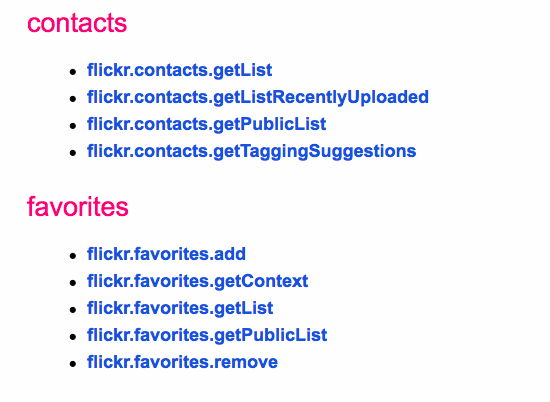

<!-- .slide: class="titulo" -->

# Tema 1
## Introducción a los servicios web REST
# Parte 4
## Más allá de REST

---

## Contenidos

1. RPC
2. GraphQL
2. APIs en tiempo real

---

<!-- .slide: class="titulo" -->

# 1. RPC 

---

## Recordar: apps web "clásicas"

- Las URL representan **operaciones** 
- Los datos de entrada se envían como **parámetros HTTP**
- Las peticiones solo pueden ser **GET** o **POST**

```http
//obviamos la autenticación para simplificar
http://uaclouddementira.ua.es/obtenerAlumno?dni=11222333F
```

Esta URL devolvería una **página HTML** con los datos del alumno 

---

Las apps webs clásicas no son **APIs**, ya que devuelven *páginas completas HTML* (==interfaz), no *datos*... pero podemos "APIficarlo" **devolviendo JSON/XML/otros**. Opcionalmente podemos enviar JSON/XML/etc en vez de usar parámetros HTTP 

Petición

```http
http://uaclouddementira.ua.es/obtenerAlumno?dni=11222333F
```

Respuesta

```javascript
{
   "dni":"11222333F"
   "nombre": "Ernesto"
   "apellidos": "Rito Bravo"
   ...  
}
```

---

## APIs RPC

Los APIs de este estilo se denominan **RPC** (Remote Procedure Call) ya que la petición HTTP es muy similar conceptualmente a la llamada a un método o función convencional

```java
Alumno obtenerAlumno(String dni) {
    ...
}

obtenerAlumno("11222333F")
```

RPC sobre HTTP

```http
http://uaclouddementira.ua.es/api/obtenerAlumno?dni=11222333F
```

---

## Recordad el API de Flickr

No es que sea REST mal diseñado, ¡¡en realidad es **RPC**!! ya que la interfaz es una lista de **operaciones** y no de **recursos**.   




---

## Recordad el API de Flickr

La única diferencia de sintaxis es que la operación en lugar de estar en la URL es un parámetro HTTP (**`method`**)

```http
https://api.flickr.com/services/rest/?method=flickr.test.echo&name=value
```

---

<!-- .slide: class="titulo" -->

# 2. GraphQL

---

<!-- .slide: class="titulo" -->

# 3. APIs en tiempo real

---
